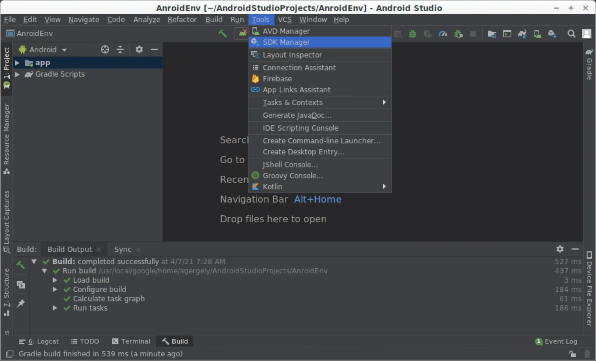
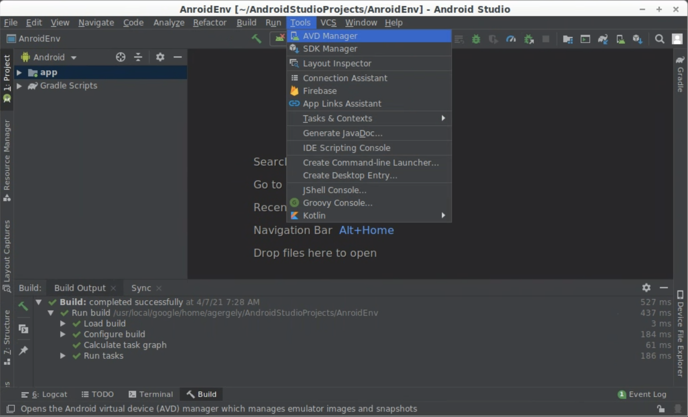
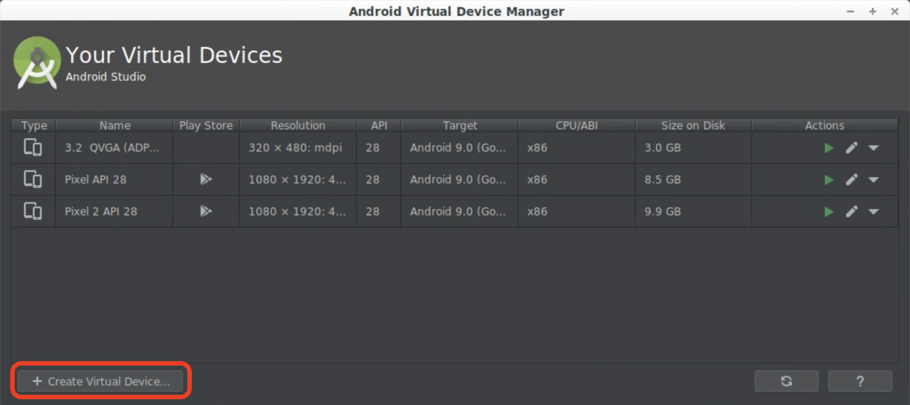
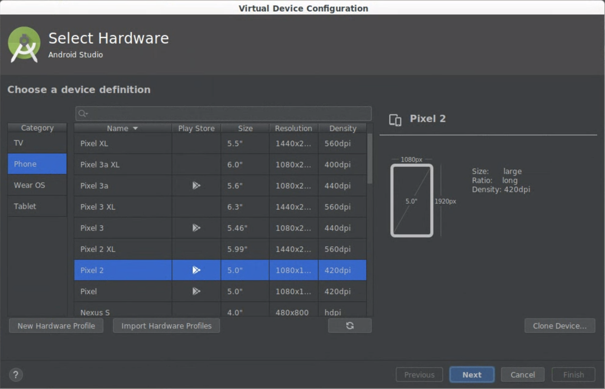
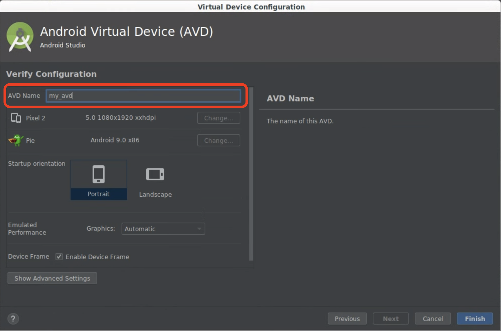
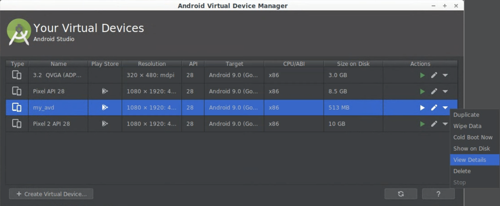
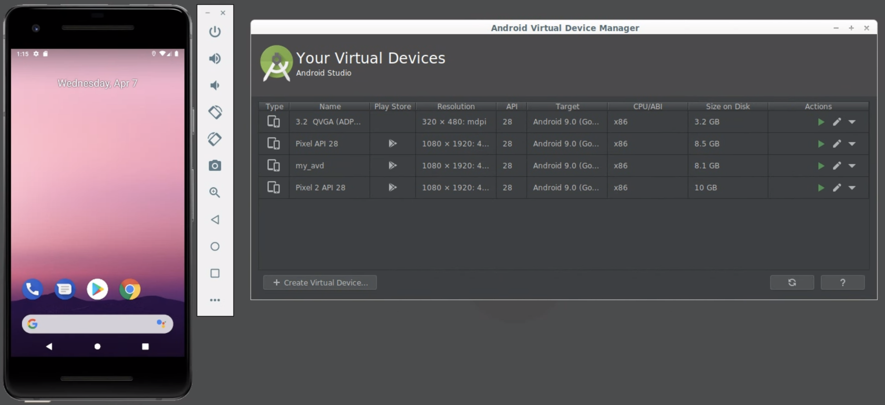

# AndroidEnv - Emulator Setup Guide

In this document we provide a step-by-step guide for creating a virtual Android
device with Android Studio. After creating an AVD
([Android Virtual Device](https://developer.android.com/studio/run/managing-avds))
you will be able to connect it to an AndroidEnv instance and you're ready to go.

To get started, you will need to download
[Android Studio](https://developer.android.com/studio) - an IDE widely used by
Android developers.

## Install an SDK Platform Package

Android Studio comes with the Android Software Development Toolkit (SDK) which,
among others, allows you to install different versions of Android. Click
on **Tools** > **SDK Manager** and select the SDK version that you would like to
use.



We recommend that you set the `Android SDK Location` to be in your home
directory (for example, on Linux the default one is `~/Android/Sdk`, while on
macOS - `~/Library/Android/sdk`). You can always find the SDK location in
Android Studio under **Preferences** > **Appearance & Behavior** >
**System Settings** > **Android SDKs** > _Android SDK Location_.

If you set the the custom `Android SDK Location`, make note of it - you will 
need it for connecting AndroidEnv to your AVD.


## Create an AVD

Now it is time to create a virtual device (AVD). Go to **Tools** >
**AVD Manager**.



In the pop-up window you will find an option to **Create Virtual Device**.



Configure the virtual device. You can select the model or choose from more
advanced settings (refer to the
[Android docs](https://developer.android.com/studio/run/managing-avds)
for step-by-step instructions).



Name your AVD and take note of this value. It will be neccessary for connecting
AndroidEnv to this virtual device.



Once you are done, you will see the new AVD show up in the **AVD Manager**.
Click on **View details** to inspect some of its properties.



Take note of the `AVD Path`. This value will be neccessary for connecting
AndroidEnv to this device. We recommend that you set this to be your home
directory (for instance, on Linux or macOS it may be  `~/.android/avd`).


## Ready to use

With SDK and AVD both set up, you are now ready to use this emulated device with
AndroidEnv. Don't forget to take note of the following three values: your AVD
name, the AVD path, and the SDK path. For example, on Linux they may be:

```
--avd_name=my_avd
--avd_package_path=~/.android/avd
--android_sdk_root=~/Android/Sdk
```

Next, once you have set up the AVD, follow the
[Task steps](instructions.md#the-task) in the
[Running the environment guide](instructions.md) to finish setting up
AndroidEnv.

However, if you want to just interact with the newly created device, click on
the run button next to your AVD in the **AVD Manager** in Android Studio (this
step is optional).


You will see an emulator window pop up. You can interact with it by clicking on
the screen.



There are many other features in Android Studio that let you customize your
device. For example, you can create custom images with pre-installed
applications or configured settings.
